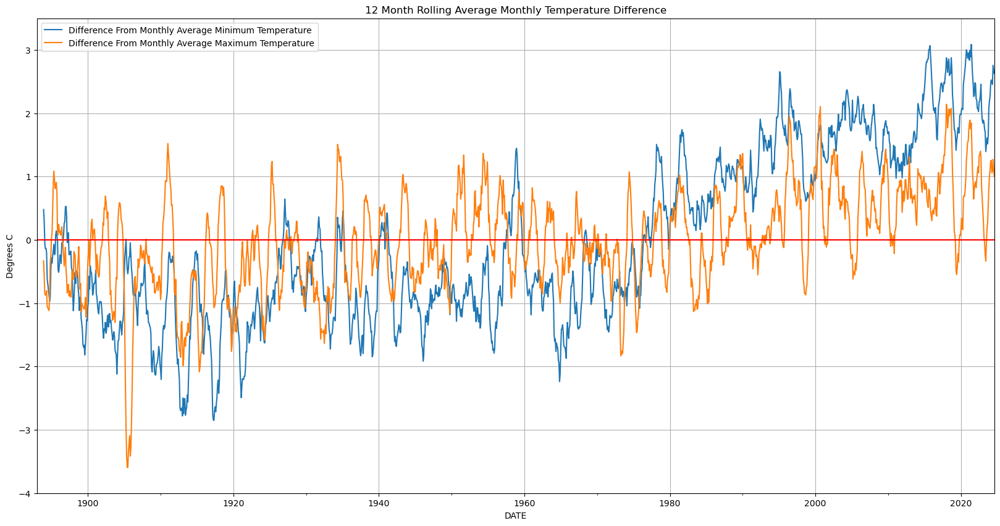

# Tucson Weather
## Analysing Historic Tucson Weather Data
This repository contains various explorations of historic weather data for Tucson, Arizona pulled from NOAA's Climate Data Online (CDO)

### Relevant Links
Data Source: https://www.ncei.noaa.gov/access/services/data/v1 (HTTP 1.1 GET request endpoint)

Request Endpoint Parameters: https://www.ncei.noaa.gov/support/access-data-service-api-user-documentation

### Station List:
        'US1AZPM0003', 'US1AZPM0004', 'US1AZPM0005', 'US1AZPM0007', 'US1AZPM0010', 'US1AZPM0014', 'US1AZPM0019',
        'US1AZPM0024', 'US1AZPM0031', 'US1AZPM0044', 'US1AZPM0050', 'US1AZPM0051', 'US1AZPM0054', 'US1AZPM0072',
        'US1AZPM0082', 'US1AZPM0087', 'US1AZPM0093', 'US1AZPM0099', 'US1AZPM0103', 'US1AZPM0104', 'US1AZPM0106',
        'US1AZPM0107', 'US1AZPM0108', 'US1AZPM0111', 'US1AZPM0114', 'US1AZPM0118', 'US1AZPM0119', 'US1AZPM0122',
        'US1AZPM0124', 'US1AZPM0125', 'US1AZPM0132', 'US1AZPM0135', 'US1AZPM0142', 'US1AZPM0143', 'US1AZPM0145',
        'US1AZPM0146', 'US1AZPM0147', 'US1AZPM0148', 'US1AZPM0149', 'US1AZPM0156', 'US1AZPM0160', 'US1AZPM0173',
        'US1AZPM0174', 'US1AZPM0181', 'US1AZPM0184', 'US1AZPM0193', 'US1AZPM0198', 'US1AZPM0199', 'US1AZPM0201',
        'US1AZPM0202', 'US1AZPM0206', 'US1AZPM0208', 'US1AZPM0210', 'US1AZPM0214', 'US1AZPM0215', 'US1AZPM0218',
        'US1AZPM0229', 'US1AZPM0233', 'US1AZPM0244', 'US1AZPM0245', 'US1AZPM0247', 'US1AZPM0248', 'US1AZPM0249',
        'US1AZPM0254', 'US1AZPM0261', 'US1AZPM0263', 'US1AZPM0265', 'US1AZPM0268', 'US1AZPM0273', 'US1AZPM0292',
        'US1AZPM0294', 'US1AZPM0301', 'US1AZPM0304', 'US1AZPM0306', 'US1AZPM0315', 'US1AZPM0321', 'US1AZPM0328',
        'US1AZPM0336', 'US1AZPM0338', 'US1AZPM0339', 'US1AZPM0340', 'US1AZPM0355', 'US1AZPM0356', 'US1AZPM0362',
        'US1AZPM0363', 'US1AZPM0366', 'US1AZPM0370', 'US1AZPM0371', 'US1AZPM0373', 'US1AZPM0374', 'US1AZPM0379',
        'US1AZPM0384', 'US1AZPM0386', 'US1AZPM0391', 'US1AZPM0399', 'US1AZPM0405', 'US1AZPM0409', 'US1AZPM0411',
        'US1AZPM0412', 'US1AZPM0415', 'US1AZPM0416', 'US1AZPM0422', 'US1AZPM0424', 'US1AZPM0426', 'US1AZPM0427',
        'US1AZPM0433', 'US1AZPM0436', 'US1AZPM0441', 'US1AZPM0442', 'US1AZPM0443', 'US1AZPM0446', 'US1AZPM0449',
        'US1AZPM0450', 'US1AZPM0460', 'US1AZPM0463', 'US1AZPM0470', 'USC00028795', 'USC00028796', 'USC00028799',
        'USC00028800', 'USC00028810', 'USC00028815', 'USC00028817', 'USW00023160', 'USW00053131'

### Parameters Included in Request:
        'ACMH', 'ACSH', 'ADPT', 'ASLP', 'ASTP', 'AWBT', 'AWND', 'DAEV', 'DAPR', 'DAWM', 'EVAP', 'FMTM', 'FRGT',
        'MDEV', 'MDPR', 'MDWM', 'MNPN', 'MXPN', 'PGTM', 'PRCP', 'PSUN', 'RHAV', 'RHMN', 'RHMX', 'SNOW', 'SNWD',
        'TAVG', 'THIC', 'TMAX', 'TMIN', 'TOBS', 'TSUN', 'WDF1', 'WDF2', 'WDF5', 'WDFG', 'WDFM', 'WDMV', 'WESD',
        'WESF', 'WSF1', 'WSF2', 'WSF5', 'WSFG', 'WSFM', 'WT01', 'WT02', 'WT03', 'WT04', 'WT05', 'WT06', 'WT07',
        'WT08', 'WT09', 'WT10', 'WT11', 'WT13', 'WT14', 'WT16', 'WT18', 'WT19', 'WT21', 'WT22', 'WV03'

## Tucson Historical Maximum and Minimum Temperature Differences From Average

